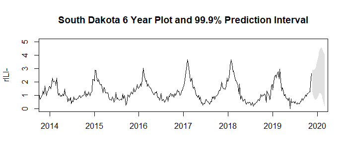
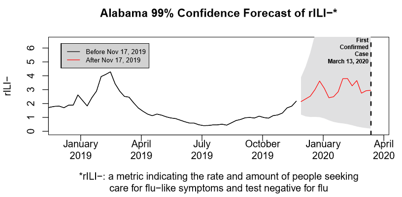
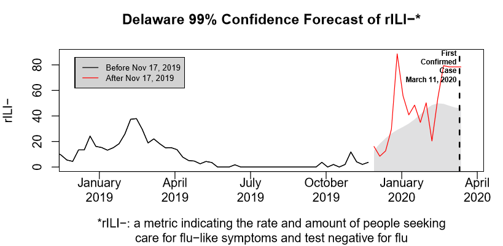
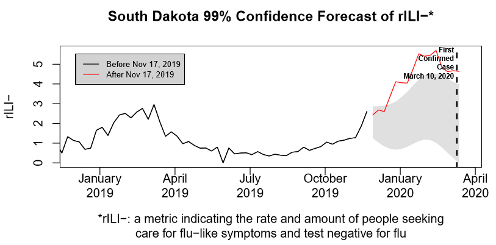

# COVID19

<h2>COVID-19: Early Signs</h2>
 A project for analyzing the amount of time coronavirus could have been present in a state prior to the date of state's first confirmed case. File description, disclaimer, potential impact, and project details below.

<h3>File description:</h3>

**states-forecast-99-pi.pdf** - Has plots of all states in our dataset. Plots show forecasted **rILI-** using a 99% prediction interval, observed data, and the date of the state's first confirmed case of COVID-19. Does not include Florida, New Jersey, or Rhode Island due to lack of data.

**states-forecast-99-9-pi.pdf** - Has plots of all states in our dataset. Plots show forecasted **rILI-** using a 99.9% prediction interval, observed data, and the date of the state's first confirmed case of COVID-19. Does not include Florida, New Jersey, District of Columbia, New Hampshire, Puerto Rico, Virgin Islands, or Rhode Island due to invalid or lack of data.

**state-data-2020-03-20.csv** - Holds data related to influenza-like illness by state. Data is pulled from https://github.com/reichlab/ncov/tree/master/analyses/ili-data.

**state-data-2020-03-20-ROUNDED.csv** - Same data as *state-data-2020-03-20.csv* except the column **rili_minus** is rounded to three decimal places to build models quicker. Should edit code to round in R.

**region-data-2020-03-20.csv** - Holds data related to influenza-like illness by region. Data is pulled from https://github.com/reichlab/ncov/tree/master/analyses/ili-data.

**region-data-2020-03-20-ROUNDED.csv** - Same data as *region-data-2020-03-20.csv* except the column **rili_minus** is rounded to three decimal places to build models quicker. Should edit code to round in R.

**states-first-confirmed.csv** - Holds the date of each state's first confirmed case of COVID-19. Source: https://www.nytimes.com/interactive/2020/03/21/us/coronavirus-us-cases-spread.html on 3/22/2020.

**ili-timeseries.R** - The R file to reproduce the forecasts.

**states-and-regions-rili-forecast.RData** - Loads the R workspace for the project.

<h3>Disclaimer</h3>

I do not have domain expertise in anything related to epidemiology. This analysis may very well be tainted by my lack of knowledge in this field. If you have domain knowledge and find something incorrect or misleading, please email me at ryan.kruse9@gmail.com.

<h3>Potential Impact</h3>
This analysis provides motivation for further research into when COVID-19 spread to the United States. For the current COVID-19 pandemic, this analysis is relatively unhelpful in the United States, because it is too late. However, in the future this type of analysis can act as an alarm of sorts. In late December 2019, the highly unexpected rates of **rILI-** in South Dakota and several other states, combined with the knowledge that COVID-19 was spreading across other parts of the world, may have been a warning sign that the virus had already spread to the United States. Next time, perhaps we can justify location-specific preventative measures earlier, potentially limiting the spread and impact of the virus.

<h3>Project Details</h3>

The goal of this project is to use the metric **rILI-** to identify states in the United States that are more likely to have had coronavirus before any cases were confirmed there. As described by Reich et. al [here](https://github.com/reichlab/ncov/blob/master/analyses/ili-labtest-report.pdf), **rILI-** is a value that measures the amount of influenza-like illness that are not attributable to influenza. It comes from CDC's Influenza-like Illness Surveillance Network (ILINet), which basically tracks the number of doctors office visits where patients had a fever and at least one other flu-like symptom, such as cough or sore throat. ILINet also tracks if the patient test positive for flu or any other known cause.

A higher **rILI-** indicates more people have flu-like symptoms with an unknown cause. Therefore, a higher **rILI-** may provide evidence for the presence of some unknown virus, such as the 2019 coronavirus.

Here is a plot of the last 6 years (until November 17th, 2019) of South Dakota's rILI-, along with the forecasted 99.9% prediction intervals from November 17th, 2019 until March 13, 2020, represented by the gray space to the right.

<i><u>Technical Details</u>: This project uses time series analysis and forecasting to predict states' **rILI-** for the weeks from November 17, 2019 until March 13, 2020. Currently, November 17, 2019 is widely believed to be approximately the earliest date the first human could have had COVID-19. The predictions were based on time series data from Week 40 of 2010 until Week 47 of 2019 (which ended on November 17). For each state, we constructed a 99.9% prediction interval based on a TBATS model using R's **forecast** package. See **Validation** at the bottom of this report.</i>

Above, we see the plot for Alabama, now focused in on the last year and a half. This state was chosen as an example of what we would expect the plots to look like. The black data line is the weekly observed data before November 17, 2019. The red line is the weekly observed data after November 17, 2019. The gray area to the right shows our forecasted 99.9% prediction interval. Based on the data prior to November 17, 2019 (and under the same circumstances), we expect 99.9% of  data points after November 17, 2019 to be in the gray area (our 99.9% prediction interval). If the observed data points fall outside of our prediction interval, then we have strong evidence the circumstances have changed and *something* suspicious is going on. This does not seem to be the case for Alabama as all the observed data points are comfortably within the prediction intervals.

Delaware and South Dakota are different stories...

Before jumping to conclusions, it's important to keep in mind that there are **many** potential caveats. For example, it's possible some of the people in South Dakota and Delaware were seeing a lot about coronavirus on the news and started going to the doctor in December 2019 when they previously wouldn't have. It's also possible that some other non-flu, non-COVID-19 illness swept through the states in late 2019.

However, South Dakota and Delaware's observed data is repeatedly and significantly outside of the 99.9% prediction interval, which provides strong evidence that ***something*** was going on starting in December 2019, about two and a half months before each state's first confirmed case of COVID-19. This analysis doesn't prove anything, but it may provide motivation for further research into when COVID-19 actually spread to South Dakota, Delaware, and other states. It's impossible to know for certain in the absence of more data.

Check out other states' plots, available here: https://github.com/kruser1/COVID19/blob/master/COVID19-early-signs/state-forecasts-99-9-pi.pdf. Some locations are not included due to lack of data. Others may have flat/meaningless graphs due to bad data. It is not known if data for New York includes New York City.

<h4>Validation</h4>
<h6>Model Selection</h6>
We used MAPE to determine the best model to use for forecasting. The possible models included Naive, Exponential Smoothing, Holt, ARIMA, TBATS, and STLF. We chose TBATS as the most consistent model after comparing the models' performance on a train/test split where the test data was the 16 weeks of data prior to the data we wanted to predict, but we expect somewhat similar prediction intervals if we had used ARIMA. Code and data are provided in repo to reproduce results.

<h6>Multiple Comparison Considerations</h6>
For the states with valid data, we made 736 prediction intervals at the 99.9% confidence level. Under the same conditions as the pre-November 17th 2019 data, we would expect about 0.1% of the observed values to land outside of our forecasted prediction intervals, which means our expected number of data points outside of the intervals is 736*.001 = .736. We found 30 data points outside of the intervals, which is about 4.1%. A binomial test with 30 successes, 736 trials, and .001 probability of success gives a p-value of < 2.2e-16. However, the binomial test may not be valid under these conditions because the data points may not be completely independent. For example, if we see South Dakota's second week of January is well outside of the prediction interval, we would be more likely to expect the third week of January to be outside the interval, as well.

So, we restructure the conditions to be more conservative. Let's instead only count a maximum of *one* success per state, where a "success" is a data point external to its 99.9% prediction interval. This means we only count one success for South Dakota (and other states like it), despite many more data points being outside of its prediction intervals. This dramatically limits the number of successes we have, but it also prevents our successful data points from being dependent on each other. This approach yields 5 successes. Using the same 736 trials (conservatively high, given that many of these trials cannot counted as successes because of our new conditions) and .001 probability of success, the binomial test gives a p-value of .0009706. Therefore, even under these conservative conditions, it appears we do not have issues with inflated significant findings due to multiple comparisons. Data and code are included in the GitHub repo.
