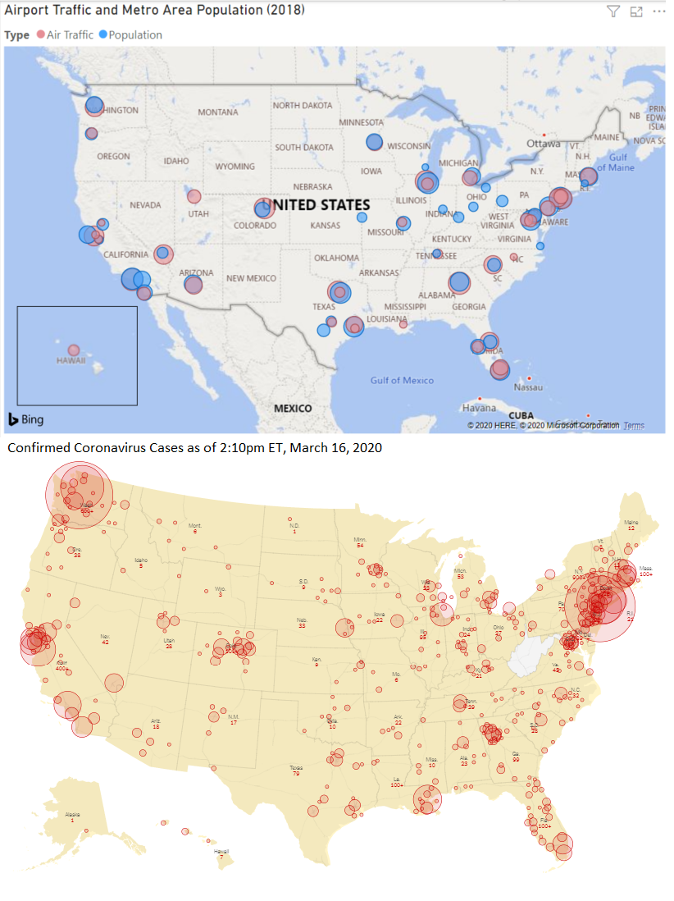

# COVID19
 A repository for organizing, mapping, and analyzing data related to COVID-19.

<h3>File description:</h3>

**AggregatedDailyData.csv** - Holds data on general locations of COVID-19 cases. Data is pulled from https://github.com/CSSEGISandData/COVID-19/tree/master/csse_covid_19_data/csse_covid_19_daily_reports. Most locations are only as specific as country. US locations are by state with some by city, too. Data is put into this file using *COVID19_Data_Pipeline.ipynb*.

**cases_air_pop_data.csv** - Holds more specific locations of US COVID-19 cases. Almost all have latitude and longitude for county or city, but a few may be by state. This data comes from https://www.kaggle.com/sudalairajkumar/novel-corona-virus-2019-dataset#COVID19_open_line_list.csv. The Kaggle dataset seems to be inconsistently updated. This CSV also contains 2018 data for the busiest airports and most heavily populated metro areas in the US. A normalized rank column was added to provide mapping options using a single CSV file. See below for an example.

**corona_mapping.twb** - Tableau file for animated map of coronavirus spread. Uses data from *cases_air_pop_data.csv*. See video below.

**COVID19_Data_Pipeline.ipynb** - An interactive Python notebook for putting data into *AggregatedDailyData.csv*.

<h3>Map Examples</h3>

These graphics show the relationship between airport traffic, metro population, and COVID-19 confirmed cases on March 16, 2020 at 2:10pm ET. The top map was made using Power BI and *cases_air_pop_data.csv*. The bottom map came from NY Times [here](https://www.nytimes.com/interactive/2020/world/coronavirus-maps.html).

<h4>Power BI</h4>
This graphic was made before confirmed case data was added to *cases_air_pop_data.csv*. Now that confirmed case data is in the same file, it is easier to put all three types of data on one map.

<h4>Tableau</h4>

This animated map shows how the confirmed cases appeared throughout the country.

